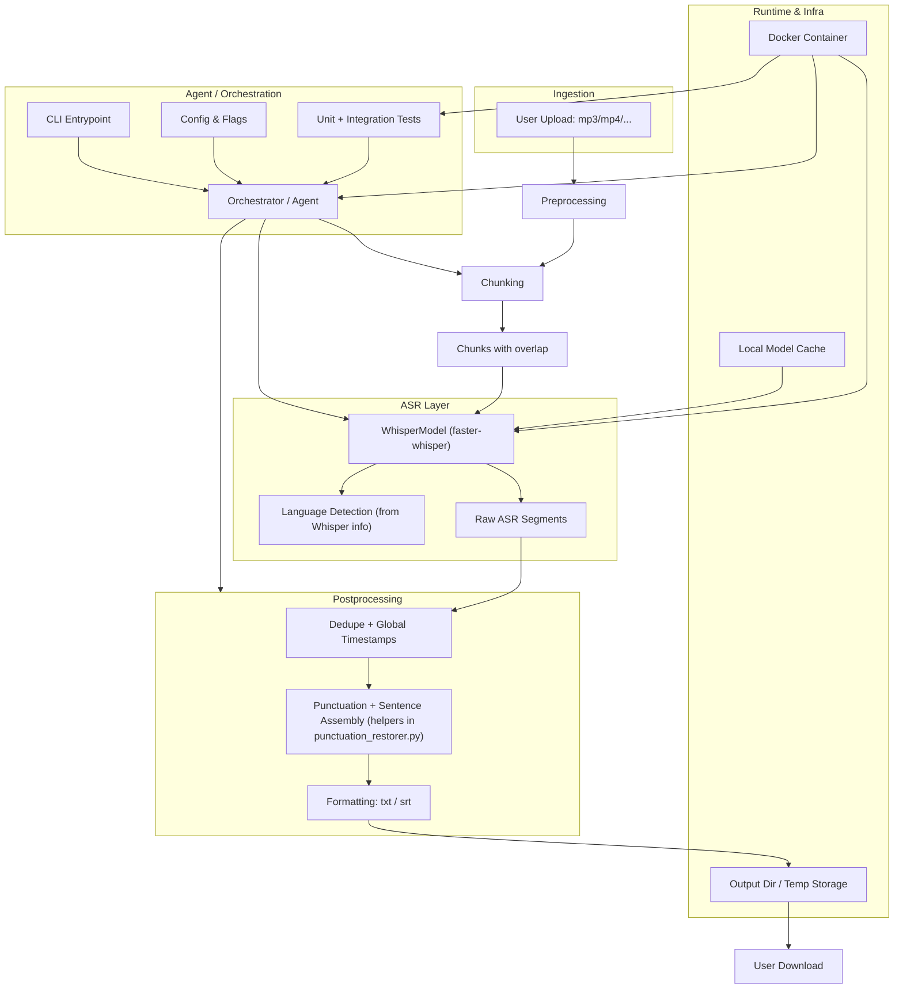

# PodScripter Architecture

PodScripter transcribes audio/video into punctuated, readable text and SRT subtitles. It uses Faster-Whisper for ASR and a hybrid semantic + rule approach for punctuation and formatting. The system is designed to run entirely in Docker with model caches mounted for reproducibility and offline operation.

## System context

- **Inputs**: Audio/video files (e.g., MP3, MP4, WAV)
- **Outputs**: Plain text (`.txt`) or subtitles (`.srt`)
- **Primary dependencies**:
  - Faster-Whisper (ASR)
  - Sentence-Transformers (semantic cues for punctuation)
  - spaCy (mandatory; automatic capitalization; models baked into Docker)
  - pydub (chunking)
- **Runtime**: Docker container; model caches bound via volumes

## Goals and non-goals

- **Goals**
  - Accurate, readable transcripts across EN/ES/FR/DE
  - Deterministic runs via containerization and caching
  - CPU-friendly defaults with support for long audio
  - Generalizable punctuation/formatting improvements over one-off fixes
  - Comprehensive domain protection (single and compound TLDs) to preserve URLs/websites in transcriptions
  - Spanish false domain prevention through centralized exclusion lists
  - Spanish-only `.de` and `.es` exclusion: `.de` and `.es` TLDs are ignored in Spanish to avoid false positives with common words "de" (preposition) and "es" (verb "is") (e.g., `tratada.de` → `tratada. de`, `naturales.es` → `naturales. es`)
- **Non-goals**
  - End-to-end cloud service or hosted UI
  - Perfect linguistic analysis for all languages
  - Arbitrary output formats beyond TXT/SRT

## High-level architecture

## Data flow

1. Pre-validate input/output paths and clean leftover chunk files.
2. If not `--single`, split media into ~480s chunks with ~3s overlap.
3. Transcribe (Faster-Whisper) with optional VAD and `initial_prompt` continuity; obtain language (if auto).
4. Convert per-chunk timestamps to global, dedupe overlap, accumulate raw text.
5. Restore punctuation using segment-aware processing (`restore_punctuation_segment()`) and assemble sentences using helper utilities (ellipsis/domain-aware; automatic spaCy capitalization).
6. Write TXT or SRT.

## Components and responsibilities

- **CLI and Orchestrator** (`podscripter.py`)
  - Parse args; validate paths
  - Choose single-call vs chunked mode
  - Manage model load, model selection, translation task, VAD settings, continuity prompts
  - Write outputs (TXT/SRT)
  - Optional raw debug dump when `--dump-raw` is set: writes `<basename>_raw.txt` containing detected language (if auto), task, segment count, and per-segment timings/text

- **Chunking**
  - `_split_audio_with_overlap(media_file, chunk_length_sec=480, overlap_sec=3)` using pydub
  - Generates chunk files and metadata for alignment

- **ASR (Faster-Whisper)**
  - `_transcribe_file(...)` → `WhisperModel.transcribe`
  - Returns segments and info (e.g., detected language)
  - Sets `task=translate` when `--translate` is provided; info logs include the selected task in CLI

- **Alignment and deduplication**
  - `_accumulate_segments(...)` and `_dedupe_segments(...)`
  - Globalize timestamps and remove overlap duplicates

- **Speaker Diarization** (`speaker_diarization.py`) - Optional
  - `diarize_audio(...)` performs speaker detection using pyannote.audio
  - `_extract_speaker_boundaries(...)` extracts speaker change timestamps
  - `_merge_boundaries(...)` merges speaker and Whisper boundaries with deduplication
  - Boundaries represent high-confidence sentence break hints

- **Punctuation and sentence assembly** (`punctuation_restorer.py`)
  - `restore_punctuation(...)` → `advanced_punctuation_restoration(...)` for complete text
  - `restore_punctuation_segment(...)` → segment-aware processing for individual Whisper segments
  - **Centralized punctuation system**: `_should_add_terminal_punctuation()` with context-aware processing
  - **Context types**: `STANDALONE_SEGMENT`, `SENTENCE_END`, `FRAGMENT`, `TRAILING`, `SPANISH_SPECIFIC`
  - Sentence-Transformers semantic cues + curated regex rules
  - Accepts merged Whisper + speaker boundaries for improved sentence splitting
  - Language-specific formatting (ES/EN/FR/DE)
  - Comma spacing normalization is centralized in `_normalize_comma_spacing(text)` and must not be duplicated inline at call sites. This helper removes spaces before commas, deduplicates multiple commas, and ensures a single space after commas. Trade-off: thousands separators like `1,000` will appear as `1, 000` to guarantee correct spacing for common number lists.
  - Comprehensive domain protection: preserves single TLDs (`github.io`, `harvard.edu`) and compound TLDs (`bbc.co.uk`, `amazon.com.br`) across all processing stages
  - Domain assembly logic: uses a general multi-pass merge loop to recover split domains across sentence boundaries and intermediate transformations
  - Spanish false domain prevention: centralized exclusion logic prevents Spanish words (e.g., `uno.de`, `este.es`, `naturales.es`) from being incorrectly treated as domains
  - Spanish processing wraps all transformations with domain masking/unmasking so that URLs (including subdomains like `www.example.com`) remain intact through punctuation and capitalization stages
  - Pipeline order correction (Spanish): automatic spaCy capitalization now runs before greeting/comma insertion to avoid capitalization feedback loops and over-capitalization of common words
  - Location appositive normalization (EN/ES/FR/DE): punctuation-restoration converts ", <preposition> <Location>. <Location>" to ", <preposition> <Location>, <Location>" using language-specific prepositions (ES: de; EN: from/in; FR: de/du/des; DE: aus/von/in). Also normalizes direct comma-separated forms like "City, Region. and/pero/y …" to keep the location intact and continue the clause. Includes a new-sentence guard to avoid merging when the following fragment starts a new sentence with a subject (e.g., "Y yo …", "And I …", "Et je …", "Und ich …").
  - TXT writer multilingual location protection: during final TXT splitting, protects appositive location patterns like ", <preposition> <Location>. <Location>" to avoid breaking location descriptions. Applies across EN/ES/FR/DE using language-specific prepositions (ES: de; EN: from/in; FR: de/du/des; DE: aus/von/in); restores protected periods after splitting.
  - Spanish greeting and inverted-question guards:
    - Guard comma insertion after greetings: avoid comma after `Hola` when followed by `a`/`para` (e.g., "Hola para todos")
    - When a greeting precedes an inverted mark (`¿`/`¡`), add a comma only if absent to prevent duplicate commas
    - If a sentence begins with a greeting and contains an embedded Spanish question, do not add a leading `¿` at the start; keep only the embedded `¿ … ?`
  - Spanish appositive merge guard: only merge `..., de <Proper>. <Proper> ...` when the second fragment is just a location continuation (minimal trailing content). Prevents accidental merging when the next sentence contains additional clauses.
  - Sentence assembly public helper:
    - `assemble_sentences_from_processed(processed, language)` which performs ellipsis continuation, domain-aware splitting, and French short-connector merging
  - Cross-segment carry of trailing fragments for French and Spanish
  - Automatic spaCy capitalization (always enabled) with mixed-language support:
    - English phrase detection in Spanish transcriptions using spaCy language detection or linguistic heuristics
    - Multi-layered location handling: spaCy NER + cross-linguistic analysis + conservative contextual patterns
    - Prevents English phrase over‑capitalization (e.g., "I am Going To Test" → "I am going to test")
    - Preserves location capitalization when already present in the input (e.g., "de Santander, Colombia")
    - Conservative location capitalization to avoid false positives:
      - Capitalize after strong cues (e.g., `vivo en`, `trabajo en`, `soy de`, `vengo de`)
      - After `de`, capitalize only when the next token was already capitalized in the input
      - After `en`, capitalize when the next token was already capitalized; avoid common nouns
  - SRT normalization in CLI: reading-speed-based cue timing; INFO log summarizes trimmed cues

## Configuration

- **Environment variables**
  - `HF_HOME`: Hugging Face cache root
  - `WHISPER_MODEL`: default Whisper model name (overridden by CLI `--model`)
  - Optionally set `HF_HUB_OFFLINE=1` when caches are warm
- **Runtime flags** (CLI)
  - `--output_dir <dir>` (required)
  - `--language <code>|auto` (default auto)
  - `--output_format {txt|srt}` (default txt)
  - `--single` (disable manual chunking)
  - `--model {tiny,base,small,medium,large,large-v2,large-v3}` (default `medium`; precedence: CLI > `WHISPER_MODEL` env > default)
  - `--translate` (Whisper `task=translate`; punctuation uses English rules)
  - `--compute-type {auto,int8,int8_float16,int8_float32,float16,float32}` (default auto)
  - `--beam-size <int>` (beam size for decoding; default 3)
  - `--no-vad` (disable VAD filtering; default is enabled)
  - `--vad-speech-pad-ms <int>` (padding in ms when VAD is enabled; default 200)
  - `--dump-raw` (also write raw Whisper output for debugging to `<basename>_raw.txt` in `--output_dir`)
  - `--enable-diarization` (enable speaker diarization for improved sentence boundaries; default disabled)
  - `--min-speakers <int>` (minimum number of speakers for diarization; default auto-detect)
  - `--max-speakers <int>` (maximum number of speakers for diarization; default auto-detect)
  - `--hf-token <str>` (Hugging Face token for pyannote model access; required for first download)
  - `--quiet`/`--verbose` (default verbose)

## Operations

- **Modes**
  - Single-call: transcribe entire file; best context, higher resource usage
  - Chunked: default for long files; overlap + prompt tail for continuity
- **Caching**
  - Mount volumes to persist models between runs:
    - Faster-Whisper via Hugging Face Hub: `models/huggingface/` → `/root/.cache/huggingface`
    - Sentence-Transformers: `models/sentence-transformers/` → `/root/.cache/torch/sentence_transformers`
    - Media: `audio-files/` → `/app/audio-files`
  - Build efficiency:
    - Combine pip installs into a single `RUN` with `--no-cache-dir`
    - Keep `COPY . .` last to maximize layer caching
    - Use `.dockerignore` to exclude large local media and caches (`audio-files/`, `models/`)
- **Error handling**
  - Early exits for invalid input or unwritable output
  - Conservative fallbacks when ST/spaCy unavailable
  - Typed exceptions surfaced from the orchestrator and mapped to exit codes:
    - `InvalidInputError` (2), `ModelLoadError` (3), `TranscriptionError` (4), `OutputWriteError` (5), unexpected (1)
  - Logging via a single `podscripter` logger; `--quiet` sets ERROR level; default INFO; `--verbose` retains informative lifecycle logs without debug output from punctuation internals

## Performance characteristics

- CPU-friendly defaults (`compute_type=auto`, modest beam size)
- Overlap + dedupe minimizes boundary artifacts
- Prompt tail (~200 chars) improves chunk continuity

## Testing and quality gates

- All tests run in Docker with caches mounted
- Language-specific and cross-language tests for punctuation, splitting, and domain protection (including compound TLD support)
- Ad-hoc `tests/test_transcription.py` for manual experiments
- Focused unit tests included by default:
  - `tests/test_sentence_assembly_unit.py` protects Spanish ellipsis/domain handling and French connector merges
  - `tests/test_chunk_merge_helpers.py` validates dedupe and accumulation correctness for segments
  - `tests/test_srt_normalization.py` validates SRT cue trimming behavior
  - `tests/test_initials_normalization.py` (WIP) documents expected behavior for person initial normalization

## Extensibility

- Add languages via `LanguageConfig` and per-language helpers
- Tune thresholds centrally without rewriting logic
- Additional output formats can be added in the writer layer

## Known limitations

- Non EN/ES/FR/DE languages are experimental
- spaCy capitalization requires language models; disabled if unavailable
- Perfect punctuation restoration is not guaranteed; favors robust heuristics
- Thousands separators include a space after commas (e.g., `1, 000`) due to centralized comma spacing. This trade-off was chosen to reliably fix number-list spacing in transcripts.
- **WIP**: Person initials (e.g., "C.S. Lewis", "J.K. Rowling") in non-English transcriptions may still split into separate sentences. Infrastructure is in place (`_normalize_initials_and_acronyms()`) but requires additional masking to protect initials through spaCy processing. See AGENT.md "Known Open Issues" for details.

## Recent architectural improvements

### Centralized Punctuation System (2025)
- **Problem solved**: Previously, period insertion logic was scattered across 14+ locations in the codebase, making bugs like "Ve a" → "Ve a." difficult to fix and maintain
- **Solution**: Centralized all punctuation decisions into `_should_add_terminal_punctuation()` with context-aware processing
- **Benefits**: 
  - Single source of truth for punctuation logic
  - Context-aware processing prevents incomplete phrase punctuation
  - Easier debugging and maintenance
  - Prevents similar bugs in the future
- **Implementation**: Uses `PunctuationContext` enum to apply different rules for different scenarios (Whisper segments vs complete sentences)

### Whisper segment boundary integration

- The orchestrator now passes `all_segments` into sentence assembly. `_assemble_sentences(all_text, all_segments, ...)` extracts Whisper segment end positions and forwards them to `restore_punctuation(text, language, whisper_boundaries=...)`.
- The punctuation pipeline converts character boundaries to word indices and uses them as prioritized hints inside `_semantic_split_into_sentences(..., whisper_word_boundaries=...)` and `_should_end_sentence_here(...)`.
- Hints are gated by grammatical rules and minimum chunk size; they are ignored for invalid break positions (e.g., conjunctions/prepositions/continuative verbs).
- Thresholds (language-agnostic; in `_get_language_thresholds(language)`):
  - `min_words_whisper_break` (default 10)
  - `max_words_force_split` (default 100)
- Backward compatible: behavior is unchanged when boundaries are not provided.

Tests: `tests/test_whisper_boundary_integration.py` covers extraction, gating, and multi-language behavior.

### Speaker Diarization Integration (2025)

Podscripter optionally uses speaker diarization to detect when speakers change, providing high-priority hints for sentence boundaries.

**Library**: pyannote.audio 3.1.1

**Integration**: Speaker boundaries are merged with Whisper segment boundaries and passed through the punctuation pipeline.

**Priority hierarchy** (in `_should_end_sentence_here`):
1. Grammatical guards (never break on conjunctions/prepositions/auxiliary verbs)
2. Speaker boundaries (high priority - almost always break)
3. Whisper boundaries (medium priority)
4. Semantic coherence (fallback)

**Opt-in**: Disabled by default, enabled via `--enable-diarization` flag.

Benefits:
- More accurate sentence breaks at dialogue transitions
- Especially useful for interviews, conversations, and multi-speaker content
- Complements existing grammatical guards and semantic analysis
- Natural speaker changes almost always align with sentence boundaries

Caching:
- Models cached in `models/pyannote/` mounted to `/root/.cache/pyannote`
- Requires Hugging Face token for first-time model download (`--hf-token` or `HF_TOKEN` env var)
- Subsequent runs use cached models for fast startup

Threading through pipeline:
- Diarization runs on media file before transcription (can be parallelized in future)
- Speaker boundaries extracted via `_extract_speaker_boundaries(...)`
- Merged with Whisper boundaries using `_merge_boundaries(...)` in `_assemble_sentences(...)`
- Boundaries within 1.0s are deduplicated to avoid redundancy
- Passed to `restore_punctuation(..., whisper_boundaries=merged_boundaries)`
- Prioritized in `_should_end_sentence_here(..., speaker_word_boundaries=...)`

Configuration:
- `DEFAULT_DIARIZATION_DEVICE = "cpu"` (can use GPU if available)
- `SPEAKER_BOUNDARY_EPSILON_SEC = 1.0` (merge boundaries within 1s)
- `MIN_SPEAKER_SEGMENT_SEC = 2.0` (ignore very short speaker segments)

## Key files

- `podscripter.py`: orchestration, chunking, ASR, output
- `punctuation_restorer.py`: punctuation, language formatting, capitalization
- `domain_utils.py`: centralized domain detection, masking, and Spanish false domain prevention
- `speaker_diarization.py`: speaker change detection and boundary extraction (optional feature)
- `Dockerfile`: runtime and dependency setup
