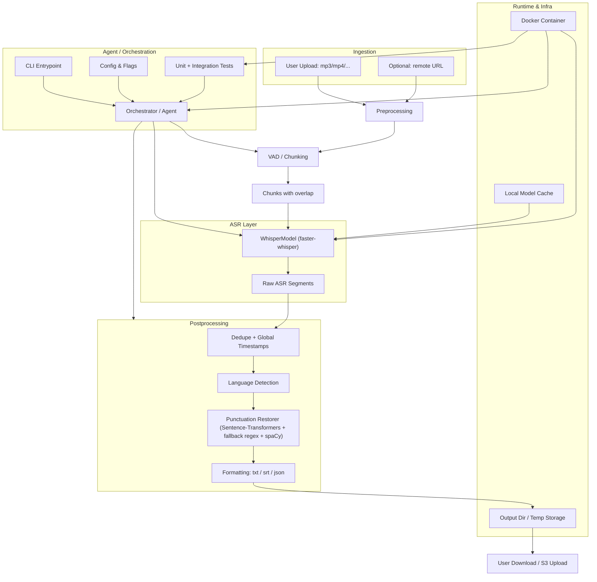

## PodScripter architecture and processing pipeline

This document explains how the project works end-to-end, the components in its pipeline, what problems each component addresses, and the role each plays in the system.

### Overview

- **Goal**: Transcribe audio/video to readable text or SRT subtitles.
- **Core ASR**: Faster-Whisper (`WhisperModel`) for transcription.
- **Punctuation**: Hybrid semantic + regex restoration with optional spaCy capitalization.
- **Languages**: English (`en`), Spanish (`es`), French (`fr`), German (`de`). Others are experimental.
- **Runtime**: Designed to run inside Docker with local model caches for offline/fast runs.

### Architecture diagram

### End-to-end pipeline

1) **CLI orchestration** (`transcribe_sentences.py`)
- **What it is**: The entrypoint that parses args and orchestrates the run.
- **Problem solved**: A consistent user interface with early validation and clear output.
- **Role**: Chooses single-call vs chunked mode, manages model settings, logging, timing.

2) **Path validation** (`_validate_paths`)
- **What it is**: Ensures input file exists and output directory is writable.
- **Problem solved**: Fails fast on bad input and permissions.
- **Role**: Normalizes paths and guarantees a safe place to write.

3) **Leftover cleanup** (`_cleanup_chunks`)
- **What it is**: Removes any stale `*_chunk_*.wav` files before starting.
- **Problem solved**: Avoids confusing results from previous partial runs.
- **Role**: Keeps the working directory clean.

4) **Audio chunking with overlap** (`_split_audio_with_overlap`)
- **What it is**: Splits long media into ~480s chunks with ~3s overlap using `pydub`.
- **Problem solved**: Makes CPU-only transcription feasible and stabilizes boundary context.
- **Role**: Produces chunk files and metadata (`path`, `start_sec`, `duration_sec`).

5) **Transcription** (`_transcribe_file` → `WhisperModel.transcribe`)
- **What it is**: Runs Faster-Whisper per file (single-call) or per chunk.
- **Problem solved**: Converts speech to time-stamped text segments with optional VAD.
- **Role**: Outputs `(segments, info)`, supports `initial_prompt` using a tail of prior text for context.

6) **Segment alignment and deduplication** (`_accumulate_segments`, `_dedupe_segments`)
- **What it is**: Converts per-chunk timestamps to global, removes duplicates from overlaps, concatenates text.
- **Problem solved**: Overlapping chunks naturally create duplicate boundaries.
- **Role**: Produces clean, globally ordered segments and a raw text stream.

7) **Punctuation restoration (hybrid)** (`punctuation_restorer.restore_punctuation`)
- **What it is**: Advanced punctuation via Sentence-Transformers semantics plus curated regex rules; safe fallback if ST unavailable.
- **Problem solved**: ASR output lacks reliable sentence boundaries and punctuation, especially questions/exclamations.
- **Role**: Returns text with punctuation appropriate for the given language.

8) **Language-specific formatting** (in `punctuation_restorer.py`)
- **What it is**: Per-language helpers with conservative, generalizable rules.
- **Problem solved**: Addresses language norms without brittle one-off hacks.
- **Role**:
  - **Spanish**: Inverted question pairing, greeting commas, exclamation wrapping for imperatives, intro/location commas, merges for possessive/gerund splits, mixed-punctuation normalization, conservative question gating.
  - **French**: Clitic inversion hyphenation (e.g., “allez-vous”), “est-ce que” normalization.
  - **German**: Safe commas before common subordinators, capitalization improvements for titles and likely nouns, proper-noun touch-ups.
  - **English/others**: Light capitalization and greeting commas; default question starters list.

9) **Sentence splitting and final normalization**
- **What it is**: After punctuation restoration, `transcribe_sentences.py` splits with `re.split(r'([.!?]+)')`, trims artifacts, and ensures closing punctuation; `punctuation_restorer` applies `_finalize_text_common` for mixed punctuation and spacing.
- **Problem solved**: Cleans remaining spacing, punctuation duplicates, and edge-case splits.
- **Role**: Produces human-readable sentences suitable for TXT and SRT.

10) **Output writers** (`_write_txt`, `_write_srt`)
- **What it is**: Writes plain text or time-aligned SRT (sorted by start time).
- **Problem solved**: Common, portable output formats.
- **Role**: Delivers final artifacts and prints the output path.

11) **Optional NLP capitalization** (`_apply_spacy_capitalization`)
- **What it is**: spaCy-based capitalization for entities and proper nouns when `NLP_CAPITALIZATION=1`.
- **Problem solved**: Heuristic capitalization can miss names/places; spaCy improves readability.
- **Role**: Conservative final pass per language; enabled by default in the Dockerfile by setting `NLP_CAPITALIZATION=1`

12) **Model caching and offline mode**
- **What it is**: Local caches for Whisper and HF models mounted into the container.
- **Problem solved**: Avoids re-downloading large models and enables offline/fast test runs.
- **Role**: Sentence-Transformers loader prefers local cache and sets `HF_HUB_OFFLINE=1` when possible.
- **Cache locations** (relative to repo root):
  - `models/whisper/`
  - `models/sentence-transformers/`
  - `models/huggingface/`

### Key files and functions

- `transcribe_sentences.py`
  - `transcribe_with_sentences(...)`: main orchestration
  - `_validate_paths`, `_cleanup_chunks`, `_split_audio_with_overlap`
  - `_transcribe_file`, `_accumulate_segments`, `_dedupe_segments`
  - `_write_txt`, `_write_srt`
- `punctuation_restorer.py`
  - `restore_punctuation(...)` → `advanced_punctuation_restoration(...)`
  - Language helpers and normalization utilities

### Development and testing

- All development and tests run inside Docker with caches mounted for speed and offline operation.
- See `tests/run_all_tests.py` and `tests/README.md` for details.

### Design principles

- **Generalizable fixes over one-offs**: Prefer language-wide heuristics and semantic gates to ad-hoc sentence exceptions.
- **Maintainability**: Centralize thresholds/keywords and keep helpers focused and testable.
- **Performance-aware**: Defaults chosen for CPU-friendly operation; supports single-call mode when resources allow.
