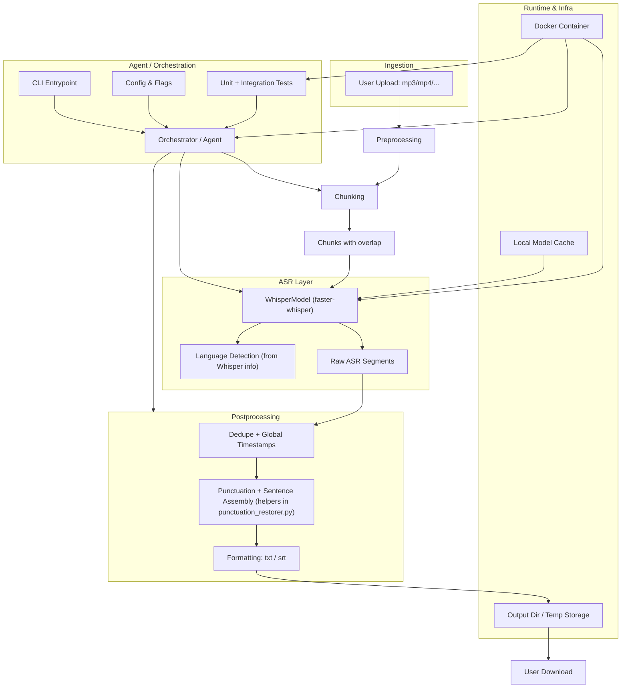

# PodScripter Architecture

PodScripter transcribes audio/video into punctuated, readable text and SRT subtitles. It uses Faster-Whisper for ASR and a hybrid semantic + rule approach for punctuation and formatting. The system is designed to run entirely in Docker with model caches mounted for reproducibility and offline operation.

## System context

- **Inputs**: Audio/video files (e.g., MP3, MP4, WAV)
- **Outputs**: Plain text (`.txt`) or subtitles (`.srt`)
- **Primary dependencies**:
  - Faster-Whisper (ASR)
  - Sentence-Transformers (semantic cues for punctuation)
  - spaCy (optional capitalization)
  - pydub (chunking)
- **Runtime**: Docker container; model caches bound via volumes

## Goals and non-goals

- **Goals**
  - Accurate, readable transcripts across EN/ES/FR/DE
  - Deterministic runs via containerization and caching
  - CPU-friendly defaults with support for long audio
  - Generalizable punctuation/formatting improvements over one-off fixes
- **Non-goals**
  - End-to-end cloud service or hosted UI
  - Perfect linguistic analysis for all languages
  - Arbitrary output formats beyond TXT/SRT

## High-level architecture

## Data flow

1. Pre-validate input/output paths and clean leftover chunk files.
2. If not `--single`, split media into ~480s chunks with ~3s overlap.
3. Transcribe (Faster-Whisper) with optional VAD and `initial_prompt` continuity; obtain language (if auto).
4. Convert per-chunk timestamps to global, dedupe overlap, accumulate raw text.
5. Restore punctuation and assemble sentences using helper utilities (ellipsis/domain-aware; optional spaCy capitalization).
6. Write TXT or SRT.

## Components and responsibilities

- **CLI and Orchestrator** (`podscripter.py`)
  - Parse args; validate paths
  - Choose single-call vs chunked mode
  - Manage model load, model selection, translation task, VAD settings, continuity prompts
  - Write outputs (TXT/SRT)

- **Chunking**
  - `_split_audio_with_overlap(media_file, chunk_length_sec=480, overlap_sec=3)` using pydub
  - Generates chunk files and metadata for alignment

- **ASR (Faster-Whisper)**
  - `_transcribe_file(...)` → `WhisperModel.transcribe`
  - Returns segments and info (e.g., detected language)
  - Sets `task=translate` when `--translate` is provided; info logs include the selected task in CLI

- **Alignment and deduplication**
  - `_accumulate_segments(...)` and `_dedupe_segments(...)`
  - Globalize timestamps and remove overlap duplicates

- **Punctuation and sentence assembly** (`punctuation_restorer.py`)
  - `restore_punctuation(...)` → `advanced_punctuation_restoration(...)`
  - Sentence-Transformers semantic cues + curated regex rules
  - Language-specific formatting (ES/EN/FR/DE)
  - Sentence assembly public helper:
    - `assemble_sentences_from_processed(processed, language)` which performs ellipsis continuation, domain-aware splitting, and French short-connector merging
  - Cross-segment carry of trailing fragments for French and Spanish
  - Optional spaCy capitalization when enabled
  - SRT normalization in CLI: reading-speed-based cue timing; INFO log summarizes trimmed cues

## Configuration

- **Environment variables**
  - `NLP_CAPITALIZATION` (default `1` in Dockerfile): enable spaCy capitalization
  - `HF_HOME`: Hugging Face cache root
  - `WHISPER_CACHE_DIR`: Whisper model cache directory
  - Optionally set `HF_HUB_OFFLINE=1` when caches are warm
- **Runtime flags** (CLI)
  - `--output_dir <dir>` (required)
  - `--language <code>|auto` (default auto)
  - `--output_format {txt|srt}` (default txt)
  - `--single` (disable manual chunking)
  - `--model {tiny,base,small,medium,large,large-v2,large-v3}` (default `medium`; precedence: CLI > `WHISPER_MODEL` env > default)
  - `--translate` (Whisper `task=translate`; punctuation uses English rules)
  - `--compute-type {auto,int8,int8_float16,int8_float32,float16,float32}` (default auto)
  - `--quiet`/`--verbose` (default verbose)

## Operations

- **Modes**
  - Single-call: transcribe entire file; best context, higher resource usage
  - Chunked: default for long files; overlap + prompt tail for continuity
- **Caching**
  - Mount volumes to persist models between runs:
    - Faster-Whisper via Hugging Face Hub: `models/huggingface/` → `/root/.cache/huggingface`
    - Sentence-Transformers: `models/sentence-transformers/` → `/root/.cache/torch/sentence_transformers`
- **Error handling**
  - Early exits for invalid input or unwritable output
  - Conservative fallbacks when ST/spaCy unavailable
  - Typed exceptions surfaced from the orchestrator and mapped to exit codes:
    - `InvalidInputError` (2), `ModelLoadError` (3), `TranscriptionError` (4), `OutputWriteError` (5), unexpected (1)
  - Logging via a single `podscripter` logger; `--quiet` sets ERROR level; default INFO; `--verbose` retains informative lifecycle logs without debug output from punctuation internals

## Performance characteristics

- CPU-friendly defaults (`compute_type=auto`, modest beam size)
- Overlap + dedupe minimizes boundary artifacts
- Prompt tail (~200 chars) improves chunk continuity

## Testing and quality gates

- All tests run in Docker with caches mounted
- Language-specific and cross-language tests for punctuation and splitting
- Ad-hoc `tests/test_transcription.py` for manual experiments
- Focused unit tests included by default:
  - `tests/test_sentence_assembly_unit.py` protects Spanish ellipsis/domain handling and French connector merges
  - `tests/test_chunk_merge_helpers.py` validates dedupe and accumulation correctness for segments
  - `tests/test_srt_normalization.py` validates SRT cue trimming behavior

## Extensibility

- Add languages via `LanguageConfig` and per-language helpers
- Tune thresholds centrally without rewriting logic
- Additional output formats can be added in the writer layer

## Known limitations

- Non EN/ES/FR/DE languages are experimental
- spaCy capitalization requires language models; disabled if unavailable
- Perfect punctuation restoration is not guaranteed; favors robust heuristics

## Key files

- `podscripter.py`: orchestration, chunking, ASR, output
- `punctuation_restorer.py`: punctuation, language formatting, capitalization
- `Dockerfile`: runtime and dependency setup
